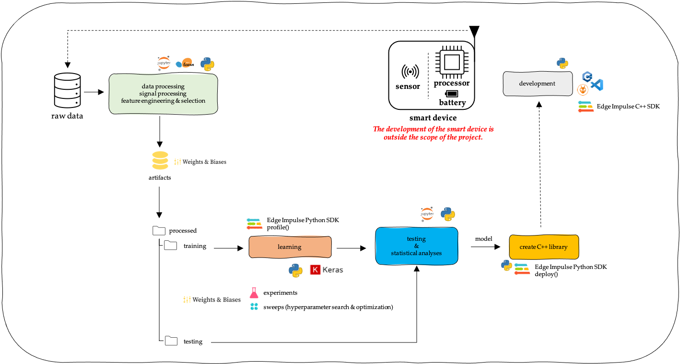

# Machine Learning @ the Extreme Edge.

  
Today's challenge is real-time and energy-efficient information extraction and processing at the edge using Artificial Intelligence. However, a recent trend exists to implement machine learning on devices located on the extreme edge, i.e. the border between the analog (physical) and digital world. These devices consist of one or more sensors and a resource-constrained embedded device, i.e. a device with limited memory, computing power, and power consumption. Today's challenge is the development of accurate, energy-efficient machine learning models for deployment on these resource-constrained devices. Machine Learning at the Extreme Edge (ML@E2dge) examines applying embedded machine learning to develop accurate, energy-efficient models for these intelligent resource-constrained devices.

  <i>
 The Embedded Machine Learning Workflow (to enlarge, click on the image). Because of the limited time, the intelligent device's development is outside this project's scope.
</i>

  
In the project, an embedded machine-learning workflow is developed, using open-source software (e.g. Python, Scikit-Learn, TensorFlow/Keras) in combination with MLOps (Machine Learning Operations) frameworks <a href="https://www.edgeimpulse.com/">Edge Impulse Studio</a> and <a href="https://wandb.ai/">Weights and Biases</a>. Besides, given a case study an embedded machine learning model is developed.

## Case Study: Gait Stride Length Estimation.

  

  <i>
 "This image was created with the assistance of DALL·E 2."
</i>

  
Spatiotemporal gait parameters, e.g., gait stride length, are measurements classicaly derived from instrumented gait analysis. Today, different solutions are available for gait assessment outside the laboratory, specifically for spatiotemporal gait parameters. Such solutions are wearable devices that comprise an inertial measurement unit (IMU) and a microcontroller (MCU). However, these existing wearable devices are resource constrained. They contain a processing unit with limited processing and memory capabilities, which limit the use of machine learning to estimate spatiotemporal gait parameters directly on the device. The solution is embedded machine learning or tiny machine learning  (tinyML™). Starting from the <a href="https://www.mdpi.com/2306-5729/6/9/95"> TRIPOD dataset</a>, and using state-of-the-art MLOps tools - <a href="https://www.edgeimpulse.com/">Edge Impulse Studio</a> and <a href="https://wandb.ai/">Weights and Biases</a> - a multilayer 1D convolutional float32 and int8 model for gait stride length estimation is developed.

 